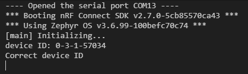
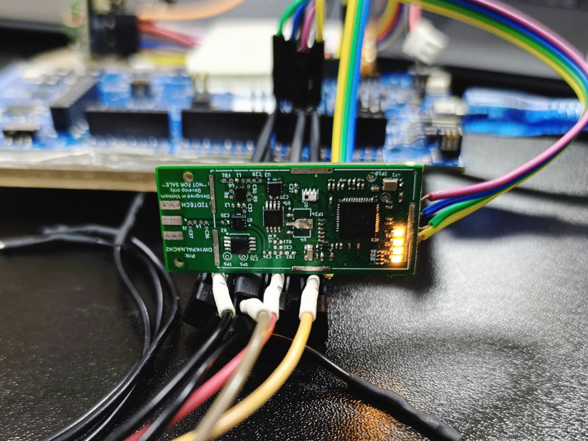

### OVERVIEW

This example is used to verify communication between host controller with dw1000 by reading device ID and set all leds high
This exmaple is tested with nRF52840dk.

### SETUPs

To build this zephyr example, you can:
1. Create Zephyr boards to your need
2. Create SPI overlay, i.e existed nrf52840dk

### RESULT

The host controller should be able to print out the dev ID:

The LEDs should all be HIGH as follows:

